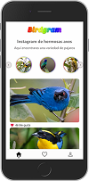
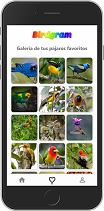

# Birdgram progresive web app

Este repositorio contiene una app sencilla para ver fotos de los pajaros mas hermosos, desarrollada con react-hooks.

[Ver la aplicación](https://react-birdgram.jorgevelasquez006.now.sh/)

## Cómo funciona?

Requiere Node.JS 10

-   `yarn` para instalar las dependencias.
-   `yarn dev` para el entorno de desarrollo.
-   `yarn build` para el entorno de producción.

## Licencia

MIT
